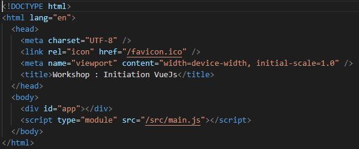
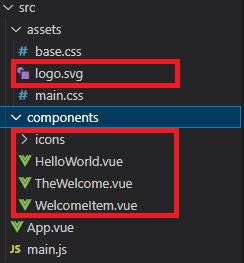
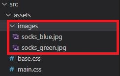
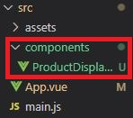
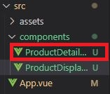

# Workshop : Vuejs Initiation

Hello to you young coder,

This workshop is offered to you in order to learn as simply and efficiently as possible how to use the Vuejs framework.

It has been very very very inspired by the [Vue Mastery course](https://youtu.be/bzlFvd0b65c) from which it takes a lot of elements but with some modifications/additions.

Do not hesitate to visit their [Youtube channel](https://www.youtube.com/c/VueMastery), their [Github](https://github.com/Code-Pop) and their [Website](https://www.vuemastery.com/).

## Recommended IDE Setup

[VSCode](https://code.visualstudio.com/) + [Volar](https://marketplace.visualstudio.com/items?itemName=Vue.volar) (and disable Vetur) + [TypeScript Vue Plugin (Volar)](https://marketplace.visualstudio.com/items?itemName=Vue.vscode-typescript-vue-plugin).

## 1.0 - Creating a Vue Application

Make sure you have an up-to-date version of [Node.js](https://nodejs.org/en/) installed, then run the following command in your command line :

```sh
> npm init vue@latest
```

This command will install and execute create-vue, the official Vue project scaffolding tool. You will be presented with prompts for a number of optional features such as TypeScript and testing support:

```sh
✔ Project name: … <your-project-name>
✔ Add TypeScript? … No / Yes
✔ Add JSX Support? … No / Yes
✔ Add Vue Router for Single Page Application development? … No / Yes
✔ Add Pinia for state management? … No / Yes
✔ Add Vitest for Unit testing? … No / Yes
✔ Add Cypress for both Unit and End-to-End testing? … No / Yes
✔ Add ESLint for code quality? … No / Yes
✔ Add Prettier for code formatting? … No / Yes

Scaffolding project in ./<your-project-name>...
Done.
```

If you are unsure about an option, simply choose "No" by hitting enter for now (However, I recommend that you at least put "Yes" to add ESLint as well as Prettier). Once the project is created, follow the instructions to install dependencies and start the dev server:

```sh
> cd <your-project-name>
> npm install
> npm run dev
```

## 2.0 - Preparation of folders and files

### 2.1 - index.html :



Here we simply change the title

### 2.2 - App.vue :

```sh
<!-- eslint-disable prettier/prettier -->
<!-- eslint-disable vue/require-v-for-key -->

<script>

</script>

<template>
  <div class="nav-bar"></div>

</template>
```

(Yes, basically, you remove everything xD)

### 2.3 - main.css :

You can copy the entire css code right [HERE](https://github.com/st2eve/vuejs-workshop/blob/main/src/assets/main.css)

### 2.4 - Files to be deleted



### 2.5 - Files to be added



You can get these images from this repository right [HERE](https://github.com/st2eve/vuejs-workshop/tree/main/src/assets/images)

## 3.0 - The project

Let's get to the heart of the matter.

First, a little overview.

The goal of this workshop is not to create a functional application, obviously, that would be far too long for an exercise that should only last a few hours.

We will create a product single page where we can add the product to a shopping cart, choose the colour, have different interactions and leave a review.

After each feature seen, a small exercise will be proposed followed by its solution.

All this will allow us to see how Vuejs works and to learn the basics which will then hopefully help you to build any frontend project.

I don't know what else to say so...Let's go !

### 3.1 - How to display data in Vue

In a first step, we will mainly work in the App.vue file.

We will first display a title for this product :

```sh
<template>
  <h1>
    Product title
  </h1>
</template>
```

So far, it's just simple html, but what we really want is to display information with Vue that we can dynamically modify as we wish.

So...

We will create a data function that will return this information :

```sh
<script>
    export default {
        data(){
            return {
              product: 'Socks',
            }
        }
    }
</script>
```

Then, in our template, we just have to import our data, here it is the product title:

```sh
<template>
  <h1>
    {{ product }}
  </h1>
</template>
```

How do the double "{{ }}" work?

Imagine that they are phones, they will make a call to the place where the information is stored, so in the data function. They're going to ask "what is the product value?" and the data function is going to say "it's Socks".

So they're going to display "Socks".

#### 3.1.1 - Challenge :

<details>
  <summary>Add a description in the data function and display it in your template in a "p" tag</summary>

```sh
  <script>
      export default {
          data(){
              return {
                  product: 'Socks',
                  description: "Beautiful and soft touch socks",
              }
          }
      }
  </script>

  <template>
      <div class="nav-bar"></div>
      <h1>
          {{ product }}
      </h1>
      <p>
          {{ description }}
      </p>
  </template>
```

</details>

### 3.2 - Attribute Binding

First, let's set up our html :

```sh
  <template>
    <div class="nav-bar"></div>

    <div class="product-display">
      <div class="product-container">
        <div class="product-image">
          <!-- image goes here -->
        </div>
        <div class="product-info">
          <h1>
            {{ product }}
          </h1>
          <p>
            {{ description }}
          </p>
        </div>
      </div>
    </div>
  </template>
```

We will use what is called attribute binding to display our images. First, we add the path of an image to our data:

```sh
  export default {
        data(){
            return {
                product: 'Socks',
                description: "Beautiful and soft touch socks",
                image: './src/assets/images/socks_green.jpg',
            }
        }
    }
```

With what we learned earlier, you would think that it would be enough to display the information between "{{ }}" like this :

```sh
  <div class="product-image">
    
  </div>
```

Well, you're almost right, but it's even simpler than that. In a tag, we won't need the "{{ }}", we'll just have to add "v-bind" before the attribute :

```sh
  <div class="product-image">
    
  </div>

  or simply

  <div class="product-image">
    
  </div>
```

What is going on here? v-bind dynamically binds an attribute to an expression. here it's the attribute "src" to the expression "image".

#### 3.2.1 - Challenge :

<details>
  <summary>Add a url in the data and bind this expression to a "href" attribute in an "a" tag. This "a" tag will contain your image.</summary>

```sh
  <script>
      export default {
          data(){
              return {
                  product: 'Socks',
                  description: "Beautiful and soft touch socks",
                  image: './src/assets/images/socks_green.jpg',
                  url: "https://vuejs.org/guide/introduction.html",
              }
          }
      }
  </script>

  <template>
      <div class="nav-bar"></div>

      <div class="product-display">
          <div class="product-container">
              <div class="product-image">
                  <a :href="url" target="_blank">
                      
                  </a>
              </div>
              <div class="product-info">
                  <h1>
                      {{ product }}
                  </h1>
                  <p>
                      {{ description }}
                  </p>
              </div>
          </div>
      </div>
  </template>
```

</details>

### 3.3 - Conditional Rendering

We add in our template :

```sh
    <div class="product-info">
        <h1>
            {{ product }}
        </h1>
        <p>
            {{ description }}
        </p>
        <p>
          In stock
        </p>
        <p>
          Out of stock
        </p>
    </div>
```

Here, we only want to display one of the 2 paragraphs, depending on whether the product is in stock or not. To do this, we will add an "inStock" property to our data which will be a boolean :

```sh
    data(){
            return {
                product: 'Socks',
                description: "Beautiful and soft touch socks",
                image: './src/assets/images/socks_green.jpg',
                url: "https://vuejs.org/guide/introduction.html",
                inStock: true,
            }
        }
```

We will be able to put this condition in our tags with the "v-if" directive :

```sh
  <p v-if="inStock">
    In stock
  </p>
  <p v-else>
    Out of stock
  </p>
```

Here we literally say "If it's in stock, show the 1st paragraph, otherwise show the 2nd".

Another way to use conditions is with v-show. The difference is that instead of acting on the display, v-show acts on the visibility.

#### 3.3.1 - Challenge :

<details>
  <summary>Add an onSale boolean to the data, use that to conditionally render a "p" tag that says "On Sale !" whenever onSale is true</summary>

```sh
<script>
    export default {
        data(){
            return {
                product: 'Socks',
                description: "Beautiful and soft touch socks",
                image: './src/assets/images/socks_green.jpg',
                url: "https://vuejs.org/guide/introduction.html",
                inStock: true,
                onSale: true,
            }
        }
    }
</script>

<template>
    <div class="nav-bar"></div>

    <div class="product-display">
        <div class="product-container">
            <div class="product-image">
                <a :href="url" target="_blank">
                    
                </a>
            </div>
            <div class="product-info">
                <h1>
                    {{ product }}
                </h1>
                <p>
                    {{ description }}
                </p>
                <p v-if="inStock">
                    In stock
                </p>
                <p v-else>
                    Out of stock
                </p>
                <p v-show="onSale">
                    On Sale !
                </p>
            </div>
        </div>
    </div>
</template>
```

</details>

### 3.4 - List Rendering

For this part, we will have a list of details of our product :

```sh
data(){
    return {
        ...,
        details: ["50% coton", "30% wool", "20% polyester"],
    }
}
```

So the question is, how do we display this list of details without being repetitive? the answer is in the v-for directive :

```sh
<div class="list">
    <ul>
        <li v-for="detail in details">
            {{ detail }}
        </li>
    </ul>
</div>
```

Let's add this code afterwards in our template. What's going on here ? We instruct that for each element we name "detail" in the "details" array, we will display a "li" tag which will contain the value of a "detail" element.

As you can see, v-for simply acts as a "for" loop.

Let's go further in the reasoning by displaying the available colours:

```sh
data(){
  return {
    ...,
    variants: [
        {
          id: 1,
          color: "green",
        },
        {
          id: 2,
          color: "blue",
        },
    ],
 }
}

<template>
  ...
  <div class="circle__container">
      <div v-for="variant in variants" :key="variant.id">
          {{ variant.color }}
      </div>
  </div>
</template>
```
Same logic as before, we also add a "key" attribute which we bind to an "id" of the "variants" array, wich gives each DOM element a unique key.

#### 3.4.1 - Challenge :

<details>
  <summary>Add an array of "sizes" to the data and use v-for to display them in a list</summary>

```sh
<script>
    export default {
        data(){
            return {
                product: 'Socks',
                description: "Beautiful and soft touch socks",
                image: './src/assets/images/socks_green.jpg',
                url: "https://vuejs.org/guide/introduction.html",
                inStock: true,
                onSale: true,
                details: ["50% coton", "30% wool", "20% polyester"],
                variants: [
                    {
                        id: 1,
                        color: "green",
                    },
                    {
                        id: 2,
                        color: "blue",
                    },
                ],
                sizes: ["XS", "S", "M", "L", "XL"],
            }
        }
    }
</script>

<template>
    <div class="nav-bar"></div>

    <div class="product-display">
        <div class="product-container">
            <div class="product-image">
                <a :href="url" target="_blank">
                    
                </a>
            </div>
            <div class="product-info">
                <h1>
                    {{ product }}
                </h1>
                <p>
                    {{ description }}
                </p>
                <p v-if="inStock">
                    In stock
                </p>
                <p v-else>
                    Out of stock
                </p>
                <p v-show="onSale">
                    On Sale !
                </p>
                <div class="list">
                    <ul>
                        <li v-for="detail in details">
                            {{ detail }}
                        </li>
                    </ul>
                    <ul>
                    <li v-for="size in sizes">
                        {{ size }}
                    </li>
                </ul>
                </div>
                <div class="circle__container">
                    <div v-for="variant in variants" :key="variant.id">
                        {{ variant.color }}
                    </div>
                </div>
            </div>
        </div>
    </div>
</template>
```
</details>

### 3.5 - Event Handling

Since this is a product page, we need to be able to add this product to a shopping cart. Let's add that :

```
data(){
  return {
    ...,
    cart: 0,
 }
}


<div class="product-info">
  ...
  <div class="circle__container">
    ...
  </div>
  <div class="button__container">
    <button class="button">
      Add to cart
    </button>
  </div>
</div>
<div class="cart">Cart ({{ cart }})</div>
```
We have added a "cart" object to the data which has the value "0". On the html side, we added the cart and the "add to cart" button.

Here we want to trigger an event on an element. In this case, each time the "add to cart" button is clicked, the cart will increase by "1". To do this, we will use the v-on directive :

```
  <div class="button__container">
    <button class="button" v-on:click="cart += 1">
      Add to cart
    </button>
  </div>

  or simply

  <div class="button__container">
    <button class="button" @click="cart += 1">
      Add to cart
    </button>
  </div>
```
However, we may need to use more complex logic that would be difficult to introduce directly into an attribute. Therefore, we will use a method :

```
data(){
  return {
    ...,
    cart: 0,
 }
},
methods: {
  addToCart(){
    this.cart += 1
  }
},
     
<div class="button__container">
  <button class="button" @click="addToCart">
    Add to cart
  </button>
</div>
```
What happens ? v-on is like an ear waiting to hear a command, in this case, the command is a click. When it hears this command, it will call the "addToCart" function. The method will then trigger the function that is being called to make it do what it is programmed to do, in this case, add "1" to the cart.

Now that we can trigger events, let's play with the colours of the product :

```
You can update your data like this :

data(){
  return {
    ...,
    variants: [
        {
          id: 1,
          color: "green",
          image: "./src/assets/images/socks_green.jpg",
        },
        {
          id: 2,
          color: "blue",
          image: "./src/assets/images/socks_blue.jpg",
        },
    ],
 }
}

And the div with your variants like this :

<div 
  v-for="variant in variants" 
  :key="variant.id" 
  @mouseover="updateImage(variant.image)"
>
  {{ variant.color }}
</div>
```
So we tell it that when a hover (mouseover) event is heard, it should trigger the "updateImage" function which will act on the element of the variant.image array and thus update the value of "image" with the path of variantImage.

#### 3.5.1 - Challenge :

<details>
  <summary>Create a new button that decrements the value of cart</summary>

```sh
<script>
    export default {
        data(){
            return {
                product: 'Socks',
                description: "Beautiful and soft touch socks",
                image: "./src/assets/images/socks_green.jpg",
                url: "https://vuejs.org/guide/introduction.html",
                inStock: true,
                onSale: true,
                details: ["50% coton", "30% wool", "20% polyester"],
                variants: [
                    {
                        id: 1,
                        color: "green",
                        image: "./src/assets/images/socks_green.jpg",
                    },
                    {
                        id: 2,
                        color: "blue",
                        image: "./src/assets/images/socks_blue.jpg",
                    },
                ],
                sizes: ["XS", "S", "M", "L", "XL"],
                cart: 0,
            }
        },
        methods: {
            addToCart(){
                this.cart += 1
            },
            removeToCart(){
                this.cart -= 1
            },
            updateImage(variantImage){
                this.image = variantImage
            },
        }
    }
</script>

<template>
    <div class="nav-bar"></div>

    <div class="product-display">
        <div class="product-container">
            <div class="product-image">
                <a :href="url" target="_blank">
                    
                </a>
            </div>
            <div class="product-info">
                <h1>
                    {{ product }}
                </h1>
                <p>
                    {{ description }}
                </p>
                <p v-if="inStock">
                    In stock
                </p>
                <p v-else>
                    Out of stock
                </p>
                <p v-show="onSale">
                    On Sale !
                </p>
                <div class="list">
                    <ul>
                        <li v-for="detail in details">
                            {{ detail }}
                        </li>
                    </ul>
                    <ul>
                    <li v-for="size in sizes">
                        {{ size }}
                    </li>
                </ul>
                </div>
                <div class="circle__container">
                    <div 
                        v-for="variant in variants" 
                        :key="variant.id" 
                        @mouseover="updateImage(variant.image)"
                    >
                        {{ variant.color }}
                    </div>
                </div>
                <div class="button__container">
                    <button class="button" @click="addToCart">
                        Add to cart
                    </button>
                    <button class="button" @click="removeToCart">
                        Remove from cart
                    </button>
                </div>
            </div>
            <div class="cart">Cart ({{ cart }})</div>
        </div>
    </div>
</template>
```
</details>

### 3.6 - Class & Style Binding

Previously, we added the possibility to see the 2 available colours of the product. For a more eye-pleasing result, how could we show the colours directly rather than the names of the colours ?

```
<div class="circle__container">
    <div 
        v-for="variant in variants" 
        :key="variant.id" 
        @mouseover="updateImage(variant.image)"
        class="color-circle"
        :style="{ backgroundColor: variant.color }"
    ></div>
</div>
```
First we add a class for css formatting. Then, remember, we use ":" followed by an attribute to bind an element. Here we tell it that in the "style" attribute its background is equal to the "color" element in the variants array.

Note that we add the element between "{ }", why ? Because we call an element of an array.

Let's play with this, let's imagine that the product is no longer in stock... It would be wise to prevent the product from being added to the cart. Let's use the same logic in this case:

```
<button 
    class="button" 
    @click="addToCart"
    :class="{ disabledButton: !inStock }"
    :disabled="!inStock"
>
    Add to cart
</button>
<button 
    class="button" 
    @click="removeToCart()"
    :class="{ disabledButton: cart == 0 }"
    :disabled="cart == 0"
>
    Remove from cart
</button>
```
We tell it that if "inStock" is false, it gains the "disabledButton" class and the "disabled" attribute, which will prevent us from clicking.

#### 3.6.1 - Challenge :

<details>
  <summary>Bind the "out-of-stock-img" class to the image whenever "inStock" is false</summary>

```sh
<script>
    export default {
        data(){
            return {
                product: 'Socks',
                description: "Beautiful and soft touch socks",
                image: "./src/assets/images/socks_green.jpg",
                url: "https://vuejs.org/guide/introduction.html",
                inStock: true,
                onSale: true,
                details: ["50% coton", "30% wool", "20% polyester"],
                variants: [
                    {
                        id: 1,
                        color: "green",
                        image: "./src/assets/images/socks_green.jpg",
                    },
                    {
                        id: 2,
                        color: "blue",
                        image: "./src/assets/images/socks_blue.jpg",
                    },
                ],
                sizes: ["XS", "S", "M", "L", "XL"],
                cart: 0,
            }
        },
        methods: {
            addToCart(){
                this.cart += 1
            },
            removeToCart(){
                this.cart -= 1
            },
            updateImage(variantImage){
                this.image = variantImage
            },
        }
    }
</script>

<template>
    <div class="nav-bar"></div>

    <div class="product-display">
        <div class="product-container">
            <div class="product-image">
                <a :href="url" target="_blank">
                    
                </a>
            </div>
            <div class="product-info">
                <h1>
                    {{ product }}
                </h1>
                <p>
                    {{ description }}
                </p>
                <p v-if="inStock">
                    In stock
                </p>
                <p v-else>
                    Out of stock
                </p>
                <p v-show="onSale">
                    On Sale !
                </p>
                <div class="list">
                    <ul>
                        <li v-for="detail in details">
                            {{ detail }}
                        </li>
                    </ul>
                    <ul>
                    <li v-for="size in sizes">
                        {{ size }}
                    </li>
                </ul>
                </div>
                <div class="circle__container">
                    <div 
                        v-for="variant in variants" 
                        :key="variant.id" 
                        @mouseover="updateImage(variant.image)"
                        class="color-circle"
                        :style="{ backgroundColor: variant.color }"
                    ></div>
                </div>
                <div class="button__container">
                    <button 
                        class="button" 
                        @click="addToCart"
                        :class="{ disabledButton: !inStock }"
                        :disabled="!inStock"
                    >
                        Add to cart
                    </button>
                    <button class="button" @click="removeToCart()">
                        Remove from cart
                    </button>
                </div>
            </div>
            <div class="cart">Cart ({{ cart }})</div>
        </div>
    </div>
</template>
```
</details>

### 3.7 - Computed Properties

We will add a new property to the data :

```
data(){
    return {
        ...,
        brand: 'Vue mastery',
    }
},
```
What would happen if we wanted to combine 2 properties ? We could do this :

```
<h1>
    {{ brand + " " + product }}
</h1>
```
This would display "Vue Mastery Socks". But still in a logic that could be more complex, there are the computed properties. This allows you to do "calculations" which will be returned more efficiently :

```
methods: {
    ...,
},
computed: {
    title() {
        return this.brand + " " + this.product;
    },
}

<h1>
    {{ title }}
</h1>
```

Now that we have learned that, let's try to go further, why not have one product of a colour in stock and the other not ?

Let's add a quantity to the variants array :

```
data(){
    return {
        ...,
        variants: [
            {
                id: 1,
                color: "green",
                image: "./src/assets/images/socks_green.jpg",
                quantity: 15,
            },
            {
                id: 2,
                color: "blue",
                image: "./src/assets/images/socks_blue.jpg",
                quantity: 0,
            },
        ],
        ...,
    }
},
```
Now let's get the image and inStock updated using the computed properties :

```
<div class="circle__container">
    <div
        v-for="(variant, index) in variants"
        :key="variant.id"
        @mouseover="updateVariant(index)"
        class="color-circle"
        :style="{ backgroundColor: variant.color }"
    ></div>
</div>
```
We modify the "@mouseover" and the "v-for" by adding the "index" element because the update will now be done according to the index of the variants array.

```
data() {
    return {
        image: "./src/assets/images/socks_green.jpg", // <= We can remove
        inStock: true, // <= We can remove
        selectedVariant: 0,
    };
},
```
we can remove "image" and "inStock" in the data and replace with "selectedVariant" which will let us know which index is chosen.

Then, in the methods, we will slightly modify the function "updateImage" which becomes "updateVariant" and which will change according to the chosen index :

```
methods: {
    ...,
    updateVariant(index) {
        this.selectedVariant = index;
    },
},
```
Now you have to be able to return the image as well as the quantity. For this, let's use the computed properties :

```
computed: {
    ...,
    image() {
        return this.variants[this.selectedVariant].image;
    },
    inStock() {
        return this.variants[this.selectedVariant].quantity;
    },
}
```
We simply return the image and the quantity of the index chosen in the "variants" array.

#### 3.7.1 - Challenge :

<details>
  <summary>Add an onSale boolean to the data (logically, it is already done) and use a computed property to display "brand + product 'is on sale'" whenever onSale is true</summary>

```sh
<script>
    export default {
        data(){
            return {
                product: 'Socks',
                description: "Beautiful and soft touch socks",
                url: "https://vuejs.org/guide/introduction.html",
                onSale: true,
                details: ["50% coton", "30% wool", "20% polyester"],
                variants: [
                    {
                        id: 1,
                        color: "green",
                        image: "./src/assets/images/socks_green.jpg",
                        quantity: 15,
                    },
                    {
                        id: 2,
                        color: "blue",
                        image: "./src/assets/images/socks_blue.jpg",
                        quantity: 0,
                    },
                ],
                sizes: ["XS", "S", "M", "L", "XL"],
                cart: 0,
                brand: 'Vue mastery',
                selectedVariant: 0,
            }
        },
        methods: {
            addToCart(){
                this.cart += 1
            },
            removeToCart(){
                this.cart -= 1
            },
            updateVariant(index) {
                this.selectedVariant = index;
            },
        },
        computed: {
            title() {
                return this.brand + " " + this.product;
            },
            image() {
                return this.variants[this.selectedVariant].image;
            },
            inStock() {
                return this.variants[this.selectedVariant].quantity;
            },
            onSaleDisplay() {
                if (this.onSale == true) {
                    return this.brand + " " + this.product + " is on sale !";
                }
                else {
                    return this.brand + " " + this.product + " will be on sale soon !";
                }
            },
        }
    }
</script>

<template>
    <div class="nav-bar"></div>

    <div class="product-display">
        <div class="product-container">
            <div class="product-image">
                <a :href="url" target="_blank">
                    
                </a>
            </div>
            <div class="product-info">
                <h1>
                    {{ title }}
                </h1>
                <p>
                    {{ description }}
                </p>
                <p>{{ onSaleDisplay }}</p>
                <p v-if="inStock">
                    In stock
                </p>
                <p v-else>
                    Out of stock
                </p>
                <div class="list">
                    <ul>
                        <li v-for="detail in details">
                            {{ detail }}
                        </li>
                    </ul>
                    <ul>
                    <li v-for="size in sizes">
                        {{ size }}
                    </li>
                </ul>
                </div>
                <div class="circle__container">
                    <div
                        v-for="(variant, index) in variants"
                        :key="variant.id"
                        @mouseover="updateVariant(index)"
                        class="color-circle"
                        :style="{ backgroundColor: variant.color }"
                    ></div>
                </div>
                <div class="button__container">
                    <button 
                        class="button" 
                        @click="addToCart"
                        :class="{ disabledButton: !inStock }"
                        :disabled="!inStock"
                    >
                        Add to cart
                    </button>
                    <button class="button" @click="removeToCart()">
                        Remove from cart
                    </button>
                </div>
            </div>
            <div class="cart">Cart ({{ cart }})</div>
        </div>
    </div>
</template>
```
</details>

### 3.8 - Components & Props

What are the components? We can think of them as lego blocks that we can fit together and the whole thing forms our Vue application.

In our files, we have kept a "components" folder (if not, create it). In it, we will create our first file, named "ProductDisplay.vue".



In this new file "ProductDisplay.vue" we will copy and paste everything we had in the file "App.vue". In the ProductDisplay data we will just remove "cart" and in the template we can remove the navbar. In "App.vue" we will remove almost everything so that only this remains :

```
<!-- eslint-disable prettier/prettier -->
<!-- eslint-disable vue/require-v-for-key -->

<script>
    export default {
        data(){
            return {
                cart: 0,
            }
        },
        methods: {
            <!-- new methods will be added later -->
        },
    }
</script>

<template>
    <div class="nav-bar"></div>
</template>
```

We agree that for the moment, nothing is displayed anymore. This is because we need to import this component into the main file "App.vue" :

```
<script>
import ProductDisplay from "./components/ProductDisplay.vue";

    export default {
        components: {
            ProductDisplay,
        },
        data(){
            return {
                ...,
            }
        },
    }
</script>

<template>
    <div class="nav-bar"></div>
    <ProductDisplay />
</template>
```
We import the content of the "ProductDisplay.vue" component and name it "ProductDisplay". Then we create a component property in which we add the name (ProductDisplay). Finally, in the template, we create a tag with this name to specify where the content of this component will be placed.

Simply magical, everything reappeared. This is how you use the components.

However, the components work a bit like a parent/child relationship, i.e. if an information is in the parent, it is out of reach of the child.

By now, you will have noticed that adding to the basket no longer works. This is normal, because the "cart" property has remained in "App.vue" and therefore cannot be updated... This is where the Props come in.

Props act as a kind of funnel between parent and child, allowing interaction between the informations.

First, let's learn how to use the Props:

```
in App.vue :

<script>
import ProductDisplay from "./components/ProductDisplay.vue";

    export default {
        components: {
            ProductDisplay,
        },
        data(){
            return {
                ...,
                premium: true,
            }
        },
    }
</script>

<template>
    <div class="nav-bar"></div>
    <ProductDisplay :premium="premium" />
</template>

in ProductDisplay.vue

export default {
    props: {
        premium: {
            type: Boolean,
            required: true,
        },
    },
    data(){
        return {
            ...,
        }
    },
    computed: {
        ...,
        shipping() {
            if (this.premium) {
                return "Free";
            }
            else {
                return 4.99;
            }
        }
    }
}

<template>
    <p v-else>
        Out of stock
    </p>
    <p>
        Shipping: {{ shipping }}
    </p>
    <div class="list">
        ...
    </div>
</template>
```
We add a "premium" property of type boolan. 

Then, in the component in the template, we bind the Props "premium" of "ProductDisplay" to "premium" of App. In the Props, "premium" must be typed and properties can be added (for example here, it must be required). 

Then, we make it a computed property in which we put a condition, if premium is true, then the delivery is free, otherwise, it costs 4.99. 

Finally, we display it in a p tag.

Now that we understand how it works, let's do the same for the cart :

```
in App.vue :

<script>
import ProductDisplay from "./components/ProductDisplay.vue";

    export default {
        components: {
            ProductDisplay,
        },
        data(){
            return {
                ...,
                premium: true,
            }
        },
    }
</script>

<template>
    <div class="nav-bar"></div>
    <ProductDisplay 
        :cart="cart"
        :premium="premium" 
    />
</template>

in ProductDisplay.vue

export default {
    props: {
        ...,
        cart: {
            type: Number,
        },
    },
}
```

#### 3.8.1 - Challenge :

<details>
  <summary>Create a new component called ProductDetails, which receives the details through a Prop called details.</summary>



```sh
ProductDisplay.vue :

<script>
import ProductDetails from "./ProductDetails.vue";

    export default {
        components: { 
            ProductDetails 
        },
        props: {
            premium: {
                type: Boolean,
                required: true,
            },
            cart: {
                type: Number,
            },
        },
        data(){
            return {
                product: 'Socks',
                description: "Beautiful and soft touch socks",
                url: "https://vuejs.org/guide/introduction.html",
                onSale: true,
                details: ["50% coton", "30% wool", "20% polyester"],
                variants: [
                    {
                        id: 1,
                        color: "green",
                        image: "./src/assets/images/socks_green.jpg",
                        quantity: 15,
                    },
                    {
                        id: 2,
                        color: "blue",
                        image: "./src/assets/images/socks_blue.jpg",
                        quantity: 0,
                    },
                ],
                sizes: ["XS", "S", "M", "L", "XL"],
                brand: 'Vue mastery',
                selectedVariant: 0,
            }
        },
        methods: {
            addToCart(){
                this.cart += 1
            },
            removeToCart(){
                this.cart -= 1
            },
            updateVariant(index) {
                this.selectedVariant = index;
            },
        },
        computed: {
            title() {
                return this.brand + " " + this.product;
            },
            image() {
                return this.variants[this.selectedVariant].image;
            },
            inStock() {
                return this.variants[this.selectedVariant].quantity;
            },
            onSaleDisplay() {
                if (this.onSale == true) {
                    return this.brand + " " + this.product + " is on sale !";
                }
                else {
                    return this.brand + " " + this.product + " will be on sale soon !";
                }
            },
            shipping() {
                if (this.premium) {
                    return "Free";
                }
                else {
                    return 4.99;
                }
            }
        }
    }
</script>

<template>
    <div class="product-display">
        <div class="product-container">
            <div class="product-image">
                <a :href="url" target="_blank">
                    
                </a>
            </div>
            <div class="product-info">
                <h1>
                    {{ title }}
                </h1>
                <p>
                    {{ description }}
                </p>
                <p>{{ onSaleDisplay }}</p>
                <p v-if="inStock">
                    In stock
                </p>
                <p v-else>
                    Out of stock
                </p>
                <p>
                    Shipping: {{ shipping }}
                </p>
                <div class="list">
                    <ProductDetails :details="details" />
                    <ul>
                    <li v-for="size in sizes">
                        {{ size }}
                    </li>
                </ul>
                </div>
                <div class="circle__container">
                    <div
                        v-for="(variant, index) in variants"
                        :key="variant.id"
                        @mouseover="updateVariant(index)"
                        class="color-circle"
                        :style="{ backgroundColor: variant.color }"
                    ></div>
                </div>
                <div class="button__container">
                    <button 
                        class="button" 
                        @click="addToCart"
                        :class="{ disabledButton: !inStock }"
                        :disabled="!inStock"
                    >
                        Add to cart
                    </button>
                    <button 
                        class="button" 
                        @click="removeToCart()"
                        :class="{ disabledButton: cart == 0 }"
                        :disabled="cart == 0"
                    >
                        Remove from cart
                    </button>
                </div>
            </div>
            <div class="cart">Cart ({{ cart }})</div>
        </div>
    </div>
</template>

ProductDetails.vue :

<script>
    export default {
        props: {
            details: {
                type: Array,
            }
        },
    }
</script>

<template>
    <ul>
        <li v-for="detail in details">
            {{ detail }}
        </li>
    </ul>
</template>
```
</details>

### 3.9 - Communicating Events

Remember, in the previous exercise, we "broke" the ability to add to the basket. We saw that the Props allowed us to pass data between a parent and child file. But how do you pass information from an event ?

The answer is the Emitting Events. This notifies the "parent" file when an event is triggered.

In the code it looks like this :

```
in ProductDisplay.vue :

methods: {
    addToCart(){
        this.$emit('add-to-cart');
    },
},

in App.vue :

methods: {
    updateCart() {
        this.cart += 1;
    },
},

<template>
    <div class="nav-bar"></div>
    <ProductDisplay 
        :cart="cart"
        :premium="premium"
        @add-to-cart="updateCart"
    />
</template>
```
Explanations. In ProductDisplay, we modify the addToCart function by telling it "when the button is clicked, you will emit radio waves (thanks to $emit) called "add-to-cart". 

Then, these waves will be perceived by a radio of the same name (@add-to-cart) which will give the order to trigger the "updateCart" function, this one being programmed to add "1" to the cart.

To go further, we can give it a condition. For example, if the quantity is greater than "0" then you can add "1" to the cart and decrease the quantity by "1" :

```
in ProductDisplay.vue :

methods: {
    addToCart(){
        if (this.variants[this.selectedVariant].quantity > 0) {
            this.$emit('add-to-cart');
            this.variants[this.selectedVariant].quantity -= 1;
        }
    },
},
```

#### 3.9.1 - Challenge :

<details>
  <summary>Modify the Remove button to make it work again.</summary>

```sh
ProductDisplay.vue :

<script>
import ProductDetails from "./ProductDetails.vue";

    export default {
        components: { 
            ProductDetails 
        },
        props: {
            premium: {
                type: Boolean,
                required: true,
            },
            cart: {
                type: Number,
            },
        },
        data(){
            return {
                product: 'Socks',
                description: "Beautiful and soft touch socks",
                url: "https://vuejs.org/guide/introduction.html",
                onSale: true,
                details: ["50% coton", "30% wool", "20% polyester"],
                variants: [
                    {
                        id: 1,
                        color: "green",
                        image: "./src/assets/images/socks_green.jpg",
                        quantity: 15,
                    },
                    {
                        id: 2,
                        color: "blue",
                        image: "./src/assets/images/socks_blue.jpg",
                        quantity: 0,
                    },
                ],
                sizes: ["XS", "S", "M", "L", "XL"],
                brand: 'Vue mastery',
                selectedVariant: 0,
            }
        },
        methods: {
            addToCart(){
                if (this.variants[this.selectedVariant].quantity > 0) {
                    this.$emit('add-to-cart');
                    this.variants[this.selectedVariant].quantity -= 1;
                }
            },
            removeToCart() {
                if (this.cart > 0) {
                    this.$emit('remove-from-cart');
                    this.variants[this.selectedVariant].quantity += 1;
                }
            },
            updateVariant(index) {
                this.selectedVariant = index;
            },
        },
        computed: {
            title() {
                return this.brand + " " + this.product;
            },
            image() {
                return this.variants[this.selectedVariant].image;
            },
            inStock() {
                return this.variants[this.selectedVariant].quantity;
            },
            onSaleDisplay() {
                if (this.onSale == true) {
                    return this.brand + " " + this.product + " is on sale !";
                }
                else {
                    return this.brand + " " + this.product + " will be on sale soon !";
                }
            },
            shipping() {
                if (this.premium) {
                    return "Free";
                }
                else {
                    return 4.99;
                }
            }
        }
    }
</script>

<template>
    <div class="product-display">
        <div class="product-container">
            <div class="product-image">
                <a :href="url" target="_blank">
                    
                </a>
            </div>
            <div class="product-info">
                <h1>
                    {{ title }}
                </h1>
                <p>
                    {{ description }}
                </p>
                <p>{{ onSaleDisplay }}</p>
                <p v-if="inStock">
                    In stock
                </p>
                <p v-else>
                    Out of stock
                </p>
                <p>
                    Shipping: {{ shipping }}
                </p>
                <div class="list">
                    <ProductDetails :details="details" />
                    <ul>
                    <li v-for="size in sizes">
                        {{ size }}
                    </li>
                </ul>
                </div>
                <div class="circle__container">
                    <div
                        v-for="(variant, index) in variants"
                        :key="variant.id"
                        @mouseover="updateVariant(index)"
                        class="color-circle"
                        :style="{ backgroundColor: variant.color }"
                    ></div>
                </div>
                <div class="button__container">
                    <button 
                        class="button" 
                        @click="addToCart"
                        :class="{ disabledButton: !inStock }"
                        :disabled="!inStock"
                    >
                        Add to cart
                    </button>
                    <button 
                        class="button" 
                        @click="removeToCart()"
                        :class="{ disabledButton: cart == 0 }"
                        :disabled="cart == 0"
                    >
                        Remove from cart
                    </button>
                </div>
            </div>
            <div class="cart">Cart ({{ cart }})</div>
        </div>
    </div>
</template>

App.vue :

<script>
import ProductDisplay from "./components/ProductDisplay.vue";

    export default {
        components: {
            ProductDisplay,
        },
        data(){
            return {
                cart: 0,
                premium: true,
            }
        },
        methods: {
            updateCart() {
                this.cart += 1;
            },
            removeFromCart() {
                this.cart -= 1;
            },
        },
    }
</script>

<template>
    <div class="nav-bar"></div>
    <ProductDisplay 
    :cart="cart"
    :premium="premium"
    @add-to-cart="updateCart"
    @remove-from-cart="removeFromCart"
    />
</template>
```
</details>